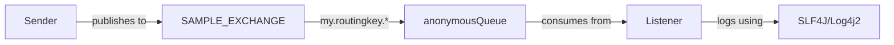

# Spring AMQP Example

A Spring-based RabbitMQ example demonstrating topic exchange, asynchronous message handling, and Spring AMQP integration.

## Table of Contents
1. [Quick Start](#quick-start)
2. [Prerequisites](#prerequisites)
3. [Architecture](#architecture)
4. [Key Concepts](#key-concepts)
   - [Message Exchange Architecture](#1-message-exchange-architecture)
   - [Routing and Binding](#2-routing-and-binding)
   - [Message Processing](#3-message-processing)
   - [Message Flow](#4-message-flow-example)
   - [Exchange Types](#5-exchange-types)
   - [Message Reliability](#6-message-reliability)
5. [Spring AMQP Configuration](#spring-amqp-configuration)
6. [Building and Running](#building-and-running)
7. [Implementation Details](#implementation-details)
8. [Logging Configuration](#logging-configuration)
9. [Security and Credentials](#security-and-credentials-management)
10. [Troubleshooting](#troubleshooting)
11. [Development Guidelines](#development-guidelines)
12. [Project Structure](#folder-structure)
    - [Directory Layout](#folder-structure)
    - [Source Code](#source-code)
    - [Configuration Files](#configuration)
    - [Build & Development](#build--development)
13. [References](#references)
14. [Version Information](#version-information)
15. [Expected Output](#expected-output)
16. [Testing](#testing)
17. [Environment Setup](#environment-setup)

## Quick Start
```bash
# 1. Start RabbitMQ Server
sudo systemctl start rabbitmq-server

# 2. Start the Listener (Terminal 1)
mvn test -Plisten

# 3. Send Messages (Terminal 2)
mvn test -Psend
```

## Prerequisites
- Java 17
- Maven
- RabbitMQ Server

## Architecture


## Spring AMQP Configuration

### 1. RabbitMQ Connection
```xml
<rabbit:connection-factory 
    id="connectionFactory"
    host="localhost"
    port="5672"
    username="guest"
    password="guest"/>
```

### 2. Topic Exchange Setup
```xml
<rabbit:topic-exchange id="exchange" name="SAMPLE_EXCHANGE">
    <rabbit:bindings>
        <rabbit:binding queue="anonymousQueue" pattern="my.routingkey.*"/>
    </rabbit:bindings>
</rabbit:topic-exchange>
```

### 3. Message Listener
```xml
<bean id="listener" class="com.acme.ch06.ex02.Listener"/>

<rabbit:listener-container connection-factory="connectionFactory">
    <rabbit:listener ref="listener" queues="anonymousQueue"/>
</rabbit:listener-container>
```

## Building and Running

### Build Options
```bash
# Full build
mvn clean install

# Skip tests
mvn clean install -DskipTests

# Skip test compilation
mvn clean install -Dmaven.test.skip=true
```

### Run Applications
1. **Start Listener**:
```bash
mvn test -Plisten
```

2. **Send Messages**:
```bash
mvn test -Psend
```

## Implementation Details

### Spring Configuration Files

1. **Listener Context** (`rabbit-listener-context.xml`):
- Connection factory configuration
- Topic exchange declaration
- Queue binding setup
- Message listener container

2. **Sender Context** (`rabbit-sender-context.xml`):
- Connection factory configuration
- RabbitTemplate setup for sending messages

### Key Components

1. **ListenerContainer.java**
- Spring context initialization
- Listener configuration loading
- Environment variable support

2. **Listener.java**
- Implements MessageListener interface
- Asynchronous message processing
- Logging integration

3. **Sender.java**
- Uses RabbitTemplate
- Topic exchange publishing
- Message routing

## Key Concepts

### 1. Message Exchange Architecture
- **Exchange**
  - Central routing component in RabbitMQ
  - Receives messages from producers
  - Routes messages to appropriate queues
  - Types: Direct, Topic, Fanout, Headers
```xml
<rabbit:topic-exchange id="exchange" name="SAMPLE_EXCHANGE">
    <rabbit:bindings>
        <rabbit:binding queue="anonymousQueue" pattern="my.routingkey.*"/>
    </rabbit:bindings>
</rabbit:topic-exchange>
```

### 2. Routing and Binding
- **Routing Keys**
  - String identifier for message routing
  - Used in topic exchanges for pattern matching
  - Example: `my.routingkey.important`
```java
channel.basicPublish("SAMPLE_EXCHANGE", "my.routingkey.alert", null, message.getBytes());
```

- **Topic Patterns**
  - `*` (star): Exactly one word
  - `#` (hash): Zero or more words
  - Examples:
    - `*.critical.*`: Matches `system.critical.alert`
    - `system.#`: Matches `system.network.error`

- **Bindings**
  - Links exchanges to queues
  - Defines routing patterns
  - Multiple bindings per queue possible
```xml
<rabbit:binding queue="anonymousQueue" pattern="my.routingkey.*"/>
```

### 3. Message Processing
- **Listener Implementation**
  - Asynchronous message processing
  - Spring AMQP `MessageListener` interface
  - Automatic message acknowledgment
```java
public class Listener implements MessageListener {
    @Override
    public void onMessage(Message message) {
        String content = new String(message.getBody());
        LOGGER.debug("Received: {}", content);
    }
}
```

- **Listener Container**
  - Manages listener lifecycle
  - Handles connection recovery
  - Provides error handling
```xml
<rabbit:listener-container connection-factory="connectionFactory">
    <rabbit:listener ref="listener" queues="anonymousQueue"/>
</rabbit:listener-container>
```

### 4. Message Flow Example
1. **Producer** sends message to exchange:
```java
template.convertAndSend("SAMPLE_EXCHANGE", "my.routingkey.alert", "High CPU usage");
```

2. **Exchange** evaluates routing key against bindings:
```xml
<rabbit:topic-exchange name="SAMPLE_EXCHANGE">
    <rabbit:bindings>
        <rabbit:binding queue="systemQueue" pattern="*.*.alert"/>
        <rabbit:binding queue="criticalQueue" pattern="#.critical.#"/>
    </rabbit:bindings>
</rabbit:topic-exchange>
```

3. **Queue** receives matching messages

4. **Listener** processes messages:
```java
@Override
public void onMessage(Message message) {
    // Process message asynchronously
    processMessage(message);
}
```

### 5. Exchange Types
- **Topic Exchange**: Pattern-based routing
- **Direct Exchange**: Exact routing key matching
- **Fanout Exchange**: Broadcast to all queues
- **Headers Exchange**: Attribute-based routing

### 6. Message Reliability
- **Publisher Confirms**
- **Consumer Acknowledgments**
- **Queue Durability**
- **Message Persistence**

### 1. Topic Exchange Pattern
- **Definition**: Messages are routed based on routing key patterns
- **Pattern Matching**: Uses wildcards (* and #)
- **Example**: `my.routingkey.*` matches any single word after `my.routingkey.`
- **Use Case**: Flexible message routing based on hierarchical patterns

### 2. Spring AMQP Integration
- **Declarative Configuration**: Using Spring XML configuration
- **Connection Management**: Automatic connection handling
- **Message Conversion**: Automatic message type conversion
- **Error Handling**: Spring's error handling mechanisms
```xml
<rabbit:listener-container connection-factory="connectionFactory">
    <rabbit:listener ref="listener" queues="anonymousQueue"/>
</rabbit:listener-container>
```

### 3. Asynchronous Message Processing
- **Event-Driven**: Non-blocking message handling
- **Message Listener**: Implementation of `MessageListener` interface
- **Container Lifecycle**: Managed by Spring container
```java
public class Listener implements MessageListener {
    @Override
    public void onMessage(Message message) {
        // Asynchronous message processing
    }
}
```

### 4. Resource Management
- **Connection Pooling**: Managed by Spring AMQP
- **Channel Management**: Automatic channel creation/cleanup
- **Queue Declaration**: Automatic queue/exchange creation
```xml
<rabbit:queue id="anonymousQueue"/>
<rabbit:topic-exchange id="exchange" name="SAMPLE_EXCHANGE"/>
```

### 5. Message Flow
1. **Publisher**:
   - Creates message with routing key
   - Publishes to topic exchange
2. **Exchange**:
   - Evaluates routing key patterns
   - Routes to matching queues
3. **Consumer**:
   - Listens to bound queue
   - Processes messages asynchronously

### 6. Configuration Externalization
- **Properties Files**: External configuration
- **Environment Variables**: Credential management
- **Profile-Based Config**: Environment-specific settings
```properties
rabbitmq.host=${RABBITMQ_HOST:localhost}
rabbitmq.port=${RABBITMQ_PORT:5672}
```

### 7. Security Features
- **Connection Security**: Username/password authentication
- **SSL/TLS Support**: Secure communication
- **Virtual Hosts**: Resource isolation
- **Permission Management**: Fine-grained access control

### 8. Monitoring & Management
- **Management Plugin**: Web-based interface
- **Queue Monitoring**: Message counts and stats
- **Connection Tracking**: Active connection management
- **Error Logging**: Comprehensive logging support

## Logging Configuration

### Log Levels
- Application (`com.acme.ch06.ex02`): DEBUG
- Spring AMQP: INFO
- Root logger: ERROR

### Output Locations
- Console: All logs
- File: Rolling file appender
  - Location: `logs/application.log`
  - Rotation: 10MB size or daily

## Troubleshooting

### Common Issues

1. **Connection Refused**
```bash
# Check RabbitMQ status
sudo systemctl status rabbitmq-server

# View logs
sudo tail -f /var/log/rabbitmq/rabbit@localhost.log
```

2. **Exchange/Queue Not Found**
```bash
# List exchanges
sudo rabbitmqctl list_exchanges

# List queues
sudo rabbitmqctl list_queues
```

3. **Permission Issues**
```bash
# List users and permissions
sudo rabbitmqctl list_users
sudo rabbitmqctl list_permissions
```

## Development Guidelines

1. **Message Publishing**
- Use routing keys matching pattern: `my.routingkey.*`
- Ensure UTF-8 encoding for messages
- Include proper message properties

2. **Error Handling**
- Implement error handlers in listener container
- Use try-with-resources for connections
- Log exceptions appropriately

3. **Testing**
- Verify queue bindings before sending
- Monitor message flow in RabbitMQ UI
- Check logs for delivery confirmations

## Security and Credentials Management

### RabbitMQ Credentials

#### 1. Environment Variables
```bash
# Set in terminal
export RABBITMQ_USERNAME=guest
export RABBITMQ_PASSWORD=guest

# Or when running Maven
RABBITMQ_USERNAME=guest RABBITMQ_PASSWORD=guest mvn test -Plisten
```

#### 2. Properties File
Create `src/main/resources/rabbitmq.properties`:
```properties
// filepath: src/main/resources/rabbitmq.properties
rabbitmq.host=localhost
rabbitmq.port=5672
rabbitmq.username=${RABBITMQ_USERNAME:guest}
rabbitmq.password=${RABBITMQ_PASSWORD:guest}
rabbitmq.virtualHost=/
```

#### 3. Spring Configuration
```xml
<!-- Load properties file -->
<context:property-placeholder location="classpath:rabbitmq.properties"/>

<!-- Use properties in connection factory -->
<rabbit:connection-factory 
    id="connectionFactory"
    host="${rabbitmq.host}"
    port="${rabbitmq.port}"
    username="${rabbitmq.username}"
    password="${rabbitmq.password}"
    virtual-host="${rabbitmq.virtualHost}"/>
```

#### 4. Maven Profile Properties
```xml
<profile>
    <id>production</id>
    <properties>
        <rabbitmq.username>@RABBITMQ_USERNAME@</rabbitmq.username>
        <rabbitmq.password>@RABBITMQ_PASSWORD@</rabbitmq.password>
    </properties>
</profile>
```

### Security Best Practices

1. **Never commit credentials**
```gitignore
# Add to .gitignore
src/main/resources/rabbitmq.properties
.env
```

2. **Use environment variables**
- Development: Use `.env` file
- Production: Use system environment variables
- CI/CD: Use secure secrets management

3. **Credential Rotation**
```bash
# Create new user
sudo rabbitmqctl add_user myapp mypassword

# Set permissions
sudo rabbitmqctl set_permissions -p / myapp ".*" ".*" ".*"
```

4. **Access Control**
```bash
# List user permissions
sudo rabbitmqctl list_user_permissions myapp

# Remove unnecessary permissions
sudo rabbitmqctl clear_permissions -p /myvhost myapp
```

5. **SSL/TLS Configuration**
```xml
<rabbit:connection-factory 
    id="connectionFactory"
    host="${rabbitmq.host}"
    port="${rabbitmq.port}"
    username="${rabbitmq.username}"
    password="${rabbitmq.password}"
    use-ssl="true"
    ssl-algorithm="TLSv1.2"
    key-store="${keystore.path}"
    key-store-password="${keystore.password}"
    trust-store="${truststore.path}"
    trust-store-password="${truststore.password}"/>
```

### Development Setup

1. **Create `.env` file**
```bash
# .env
RABBITMQ_USERNAME=dev_user
RABBITMQ_PASSWORD=dev_password
```

2. **Load environment in VS Code**
Update `.vscode/launch.json`:
```json
{
    "configurations": [
        {
            "type": "java",
            "name": "Launch Application",
            "envFile": "${workspaceFolder}/.env"
        }
    ]
}
```

3. **Dev Container Configuration**
Update `devcontainer.json`:
```jsonc
{
    "remoteEnv": {
        "RABBITMQ_USERNAME": "${localEnv:RABBITMQ_USERNAME}",
        "RABBITMQ_PASSWORD": "${localEnv:RABBITMQ_PASSWORD}"
    }
}
```

## References
- [Spring AMQP API Documentation](https://docs.spring.io/spring-amqp/docs/current/api/)
- [RabbitMQ Tutorial](https://www.rabbitmq.com/tutorials)

## Version Information
- Spring AMQP: 3.2.4
- RabbitMQ Client: 5.25.0
- Java: 17
- Log4j2: 2.24.3
- SLF4J: 2.0.17

## Expected Output

### Listener Start
```log
[INFO] Start
[DEBUG] Context successfully created from: rabbit-listener-context.xml
[DEBUG] Waiting for messages...
```

### Sender Execution

```log
[INFO] Start
[DEBUG] Sent message with routing key 'my.routingkey.test'
[INFO] End
```

## Common Error Resolution

| Error | Possible Cause | Resolution |
|-------|---------------|------------|
| Connection refused | RabbitMQ not running | `sudo systemctl start rabbitmq-server` |
| Authentication failed | Invalid credentials | Check username/password in configuration |
| Exchange not found | Exchange not declared | Verify exchange declaration in XML |
| Queue not bound | Missing binding | Check binding pattern in configuration |

## Testing

### Unit Tests
```bash
mvn test
```

### Integration Tests
- Start RabbitMQ
- Run listener
- Send test messages
- Verify in management console

### Load Testing
Using JMeter or similar tools for performance testing

## Environment Setup

### Local Development
```bash
# Clone repository
git clone <repository-url>
cd practical-microservices-architectural-patterns

# Build project
mvn clean install

# Set up RabbitMQ
sudo systemctl start rabbitmq-server
sudo rabbitmqctl add_user test test
sudo rabbitmqctl set_permissions -p / test ".*" ".*" ".*"
```

## Folder Structure

```
Ch06_Source/ch06/ch06-02/
├── .devcontainer/
│   └── devcontainer.json          # Dev container configuration
├── .vscode/
│   └── launch.json                # VS Code launch configurations
├── src/
│   └── main/
│       ├── java/
│       │   └── com/acme/ch06/ex02/
│       │       ├── Listener.java          # Message consumer
│       │       ├── ListenerContainer.java # Spring context loader
   - `Listener.java`: Implements message consumption logic
   - `ListenerContainer.java`: Manages Spring context for listener
   - `Sender.java`: Implements message sending logic

2. **Configuration**
   - `rabbit-listener-context.xml`: Topic exchange and listener setup
   - `rabbit-sender-context.xml`: Sender configuration
   - `log4j2.xml`: Logging configuration
   - `rabbitmq.properties`: Connection properties

3. **Build & Development**
   - `pom.xml`: Project dependencies and build configuration
   - `devcontainer.json`: Development container setup
   - `launch.json`: VS Code debugging configurations

4. **Documentation**
   - `README.md`: Project documentation and usage guide